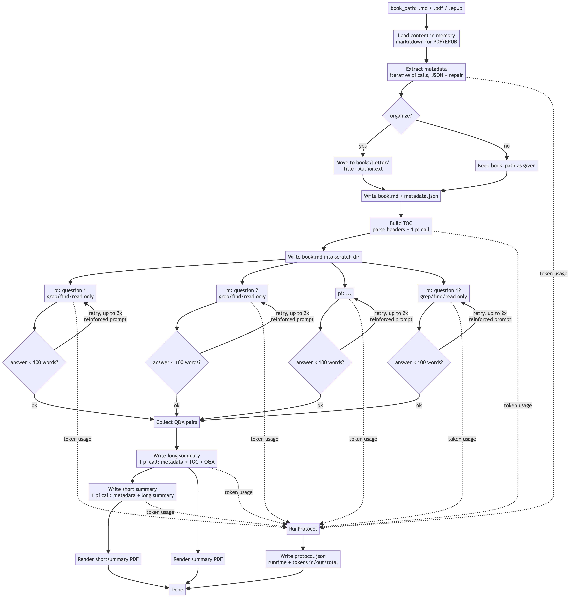

# pi_bookworkflow

`source/workflows/pi_bookworkflow.py` (console script: `uv run booksummary <book_path> [options]`) turns a book (Markdown, PDF, or EPUB) into a long summary, a short summary, and a run report — using the [pi](https://pi.dev) coding agent CLI as the only LLM backend.

It re-implements an earlier LangGraph + vector-store book-summary pipeline, without either dependency:

- **No LangGraph.** Every step is a stateless call to a fresh `pi --mode json --no-session -p "..."` subprocess, so the whole thing is a plain top-to-bottom `asyncio` pipeline instead of a graph — there's no shared state to thread through a runtime.
- **No vector store.** Instead of embedding the book into chunks and giving the model a similarity-search tool, one `pi` subprocess per question runs with its working directory set to a scratch folder holding the book's full text, and only the `grep`/`find`/`read` tools enabled. The agent does its own thorough text search over the real file.
- **No structured-output API.** pi has no schema-constrained output, so the metadata-extraction step asks the model for raw JSON and repairs it with a corrective follow-up call if parsing fails (up to 3 attempts).

## Steps

1. **Load** — read the book. `.md` is read as-is; `.pdf`/`.epub` are converted via `markitdown`. Content stays in memory; nothing is written yet.
2. **Extract metadata** — scan the first few chunks of the book (front matter, title/copyright pages) for title, author, publication year, and genre, iterating until the model reports it's confident or a chunk cap is hit. Each attempt is a `pi --no-tools` call whose JSON reply is parsed and repaired on failure.
3. **File into the library** — once title/author are known, move the source file to `<books-path>/Letter<X>/<Title, ':'→'_'> - <Author>.<ext>` (X = the title's first letter), unless `--no-organize` is passed. `<books-path>` is the `--books-path` flag, defaulting to the `BOOKS_PATH` env var if set, else `./books`. All derived outputs are written next to wherever the book ends up.
4. **Build table of contents** — markdown headers are parsed directly (no LLM needed to find them), then one `pi` call formats the hierarchy into a clean TOC.
5. **Answer questions (textsearch fan-out)** — 12 fixed questions about the book (thesis, key arguments, vivid examples, conclusions, ...) are each answered by a concurrent `pi` subprocess restricted to `grep`/`find`/`read` over the book's full text in a scratch directory. If an answer comes back under 100 words (a weak/free model can occasionally return a near-empty answer under concurrent load), it's retried with a fresh, reinforced stateless call, up to 2 times.
6. **Write long summary** — one `pi` call synthesizes metadata + TOC + all 12 Q&A pairs into a 2000–3000 word summary.
7. **Write short summary** — one `pi` call condenses metadata + the long summary into a 200–300 word summary.
8. **PDF rendering** — both summaries are also rendered to PDF via `markdown` → HTML → `weasyprint` (imported lazily, since it needs native Pango/GObject libraries only present at PDF-render time).
9. **Protocol** — every `pi` call is timed and its token usage (parsed from the `--mode json` event stream) is recorded; the totals and a per-call breakdown are written to `<book>_protocol.json`.

## Outputs

For a book filed at `books/LetterL/Love Machines - James Muldoon.epub`, one run produces:

| File | Contents |
|---|---|
| `..._metadata.json` | title, author, publication year, genre, tags |
| `....md` | full book text (converted, if source was PDF/EPUB) |
| `..._summary.md` / `.pdf` | long summary |
| `..._shortsummary.md` / `.pdf` | short summary |
| `..._protocol.json` | runtime + input/output/total tokens, per pi call and summed |

A run is considered complete when all seven files exist; re-running without `--force` skips already-complete books.

## Diagram

A scalable version is at [pi_bookworkflow.svg](pi_bookworkflow.svg).

## Known environment notes

- Only `pi`'s configured provider(s) can be used (`--provider`/`--model` flags pass straight through); check `pi --list-models`.
- `.env` (loaded automatically) can set `BOOKS_PATH` to point `--books-path` at wherever the real `Letter<X>/` library lives, instead of passing it on every invocation.
- `weasyprint` needs native Pango/GObject libraries. On macOS with Homebrew, the script points `DYLD_LIBRARY_PATH` at `/opt/homebrew/lib` or `/usr/local/lib` automatically if neither is already set.
- A weak/free model can produce a near-empty answer for an occasional question under concurrent load; answers under `MIN_ANSWER_WORDS` (100) are automatically retried with a fresh, reinforced call (up to `MAX_THIN_ANSWER_ATTEMPTS`, 2). The 12 questions also deliberately overlap, so the long-summary synthesis step stays resilient even if a retry still comes back thin. Check `protocol.json`'s per-call `output_tokens` and `question_*_thin_retry_*` labels if a summary reads thin.
